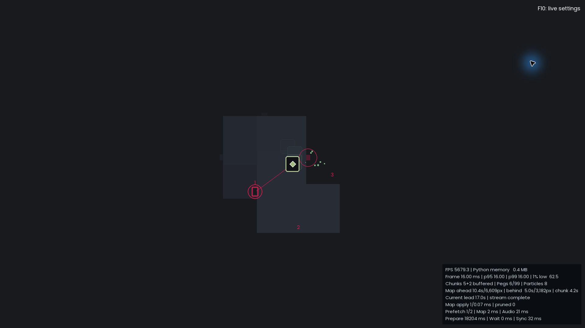
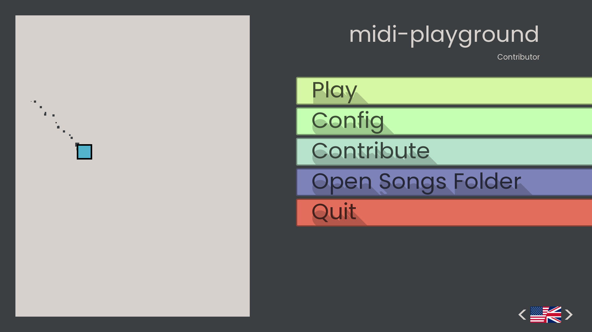
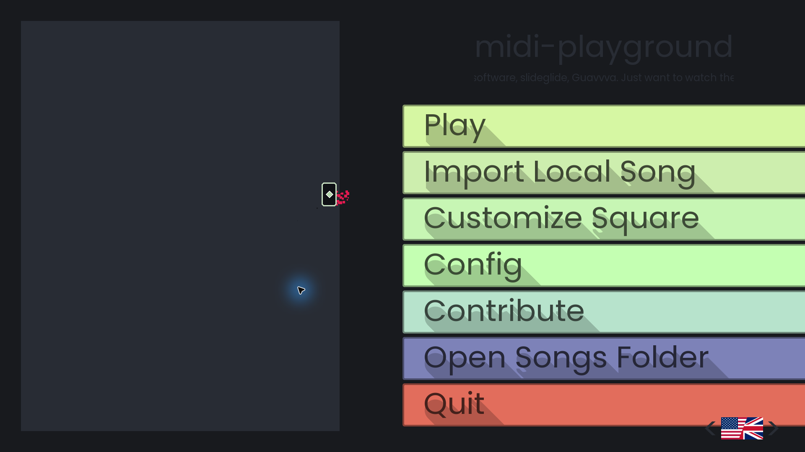
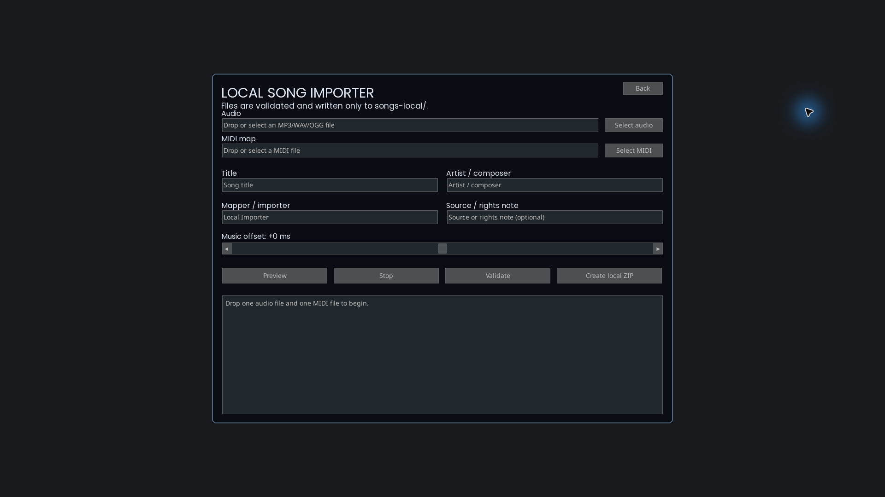
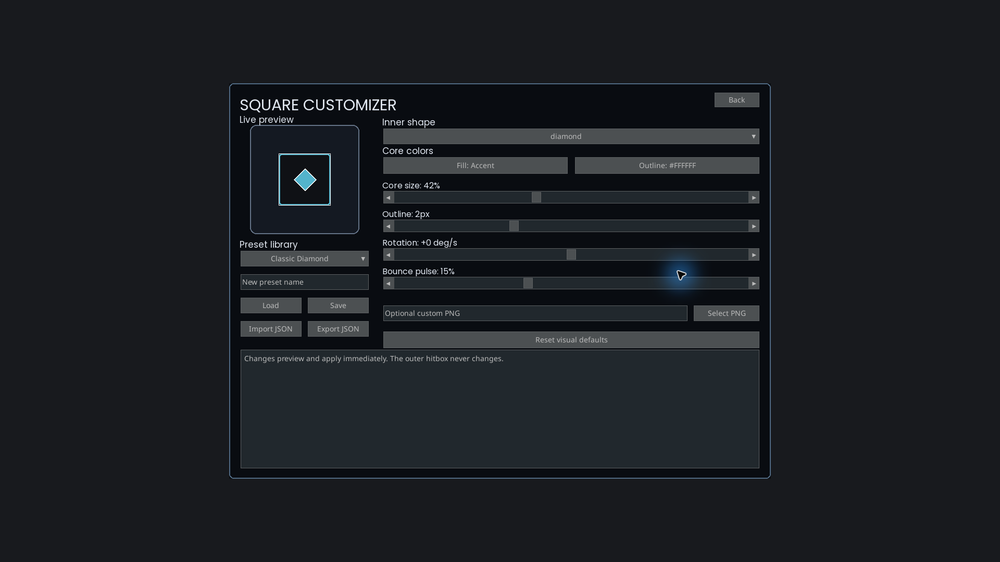
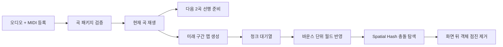

# MIDI Live Playground

MIDI와 오디오를 따라 움직이는 스퀘어 영상을 **연속 재생·실시간 맵 스트리밍·음악 패키징·라이브 디자인 편집**까지 확장한 Shorts 제작 도구입니다.

[](https://github.com/Jung-Que/midi-playground/actions/workflows/windows-validation.yml)


<p align="center">
  
</p>

## 원작에서 달라진 점

이 저장소는 [quasar098/midi-playground](https://github.com/quasar098/midi-playground)를 포크해, 한 곡을 감상하는 데모를 반복 제작에 사용할 수 있는 도구로 확장한 버전입니다.

<table>
  <tr>
    <th width="50%">Original</th>
    <th width="50%">MIDI Live Playground</th>
  </tr>
  <tr>
    <td></td>
    <td></td>
  </tr>
  <tr>
    <td>단일 곡 실행과 기본 설정 중심</td>
    <td>로컬 음악 등록과 스퀘어 커스터마이저를 메인 메뉴에 통합</td>
  </tr>
</table>

| 구분 | 원작 | 확장 버전 |
| --- | --- | --- |
| 재생 | 곡마다 다시 선택 | 현재 곡부터 연속 재생, 다음 2곡 선행 준비 |
| 맵 | 재생 전 전체 맵 생성 | 재생 중 시간 단위 청크 생성·적용·정리 |
| 충돌 탐색 | 전체 객체 순회 | Spatial Hash 기반 근접 객체 탐색 |
| 음악 등록 | ZIP 구조를 수동 편집 | MP3/WAV/OGG + MIDI 선택, 메타데이터 입력, 검증 및 패키징 |
| 디자인 | 고정된 스퀘어 표현 | 외곽 히트박스는 유지하고 내부 심볼·색·효과를 실시간 변경 |
| 운영 | 한 번 실행하는 데모 | 성능 HUD, 로그, 장시간 검증, Windows 패키징 파이프라인 |

## 제작 기능

<table>
  <tr>
    <td width="50%"></td>
    <td width="50%"></td>
  </tr>
  <tr>
    <td><strong>음악 패키징</strong><br>오디오와 MIDI를 선택하고 제목·아티스트·매퍼·출처·타이밍을 입력합니다. 형식과 노트 밀도, 중복 파일을 검사한 뒤 로컬 곡 패키지로 생성합니다.</td>
    <td><strong>스퀘어 커스터마이징</strong><br>외곽 스퀘어의 충돌 크기는 그대로 두고 내부 심볼, 채우기·윤곽 색, 크기, 회전, 바운스 펄스를 편집하고 프리셋으로 저장합니다.</td>
  </tr>
</table>

## 핵심 기능

- **끊김을 줄인 연속 재생** — 다음 2곡의 오디오와 맵을 백그라운드에서 준비하고, 준비가 늦으면 안전하게 기다리며 실패한 곡은 건너뜁니다.
- **실시간 맵 스트리밍** — 워커 프로세스가 미래 구간을 청크로 생성하고, 게임 월드는 바운스 단위로 반영합니다. 화면 뒤 기록은 보존 구간이 지난 뒤 제거합니다.
- **시간축 동기화** — 오디오 재생 위치와 바운스 스케줄을 기준으로 월드 시간과 스퀘어 위치를 맞추고, 아직 처리되지 않은 다음 충돌을 지나치지 않도록 제한합니다.
- **가독성 중심의 페그 표현** — 가까운 목표만 선별해 번호·카운트다운·충돌 확인 효과를 표시하고, 지나간 페그와 이펙트는 점진적으로 정리합니다.
- **F10 라이브 설정** — 색, 파티클, 글로우, 카메라, 볼륨, 맵 보존 범위, 페그 수와 간격, 타깃 가이드를 재생 중 변경합니다.
- **Shorts 모드** — 세로 해상도, 안전 여백, 클린 UI, 곡 제목, 카운트다운과 15/30/60초 반복 구간을 지원합니다.

## 빠른 실행

Python 3.11 환경을 권장합니다.

```powershell
git clone https://github.com/Jung-Que/midi-playground.git
cd midi-playground
py -3.11 -m venv .venv
.\.venv\Scripts\Activate.ps1
python -m pip install -r requirements.txt
python main.py
```

메인 메뉴에서 곡을 선택하면 연속 재생이 시작됩니다. 게임 중 `F10`으로 라이브 설정을 열고, 방향키로 항목과 값을 변경할 수 있습니다.

## 처리 구조



맵 청크는 운반 단위일 뿐 화면에 한 번에 나타나지 않습니다. 게임 루프가 처리 가능한 양만 반영해, 생성과 삭제가 프레임을 오래 점유하지 않도록 구성했습니다.

## 로컬 데이터와 공개 범위

- `songs-local/` — 저작권이나 재배포 권한을 확인하지 않은 개인 음악
- `imports-local/` — 음악 등록 중간 파일
- `presets-local/` — 사용자 이미지와 스퀘어 프리셋
- `exports/`, `logs/` — 빌드 결과와 실행 로그

위 경로는 Git에서 제외되며 검증된 배포 패키지에도 포함되지 않습니다. 공개 저장소의 `songs/`에는 재배포가 허용된 곡만 추가해야 합니다.

## 테스트와 Windows 배포

```powershell
python -m unittest discover -s tests -q
python tools/build_release.py
```

배포 스크립트는 테스트 실행, 공개 파일 allowlist 검사, Windows 실행 파일 생성, 스트리밍·Shorts·음악 등록·커스터마이저 smoke test, 개인 데이터 혼입 검사를 거쳐 버전 ZIP과 SHA-256 파일을 `exports/releases/`에 생성합니다. 자세한 절차는 [배포 가이드](docs/RELEASE.md)를 참고하세요.

## 원작과 라이선스

- Upstream: [quasar098/midi-playground](https://github.com/quasar098/midi-playground)
- Credits: [docs/CREDITS.md](docs/CREDITS.md)
- License: [GNU GPL v3](LICENSE)

이 프로젝트의 수정본을 공개 배포할 때는 GPL-3.0 조건에 따라 해당 소스 코드도 제공해야 합니다.

## 추가 개선과 영상 업스케일링

맵 스트리밍과 렌더링 안정성을 개선하고, 녹화본을 편집용 고해상도 마스터로 변환하는 보조 도구를 제공합니다.

- 화면 이동 거리와 해상도에 맞춰 맵 look-ahead, history, chunk duration과 worker buffer를 조절하는 적응형 rolling window
- 프레임별 적용·제거 시간 예산과 HUD 지표 확장
- 스퀘어 외곽선, 모서리, 방향광과 잔상 표현 보정
- `1440x2560`, `2160x3840` 세로 캡처 옵션과 편집용 2배 업스케일 도구

```powershell
winget install Gyan.FFmpeg
python tools/upscale_video.py "input.mp4"
```

업스케일 도구는 원본 프레임률과 오디오를 유지하고 Lanczos 확대와 제한적인 샤프닝을 적용합니다. 다만 원본에 없던 디테일을 복원하는 방식은 아니므로, 확대 편집이 필요하면 네이티브 `2160x3840` 캡처를 우선합니다.
